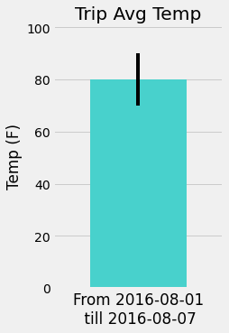

## SQLAlchemy - Surfs Up!

Congratulations! You've decided to treat yourself to a long holiday vacation in Honolulu, Hawaii! To help with your trip planning, you need to do some climate analysis on the area. The following outlines what you need to do.
 
 
### Python and SQLAlchemy are used to do basic climate analysis and data exploration of the climate database.

Amount of precipitation over a selected year timeframe

Statical summary of precipitation for all stations over a year period

Sorting the station with the most results and ploting temp observed

### Create a Flask based API based on researched data

Looking back one year and finding results to estimate weather for upcomming trip  
with error possibility included

